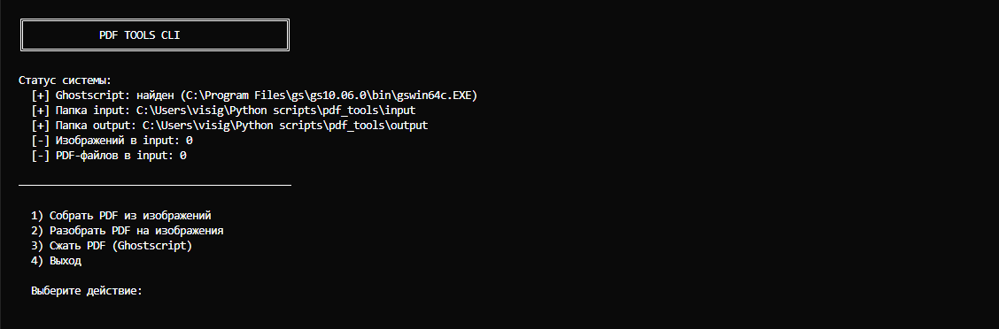

# PDF Tools CLI

Консольный инструмент для объединения, извлечения и сжатия PDF-файлов.

---

## 🚀 Features

- 📄 Объединение изображений в PDF
- 🖼 Извлечение страниц PDF в изображения
- 📉 Сжатие PDF через Ghostscript
- ⚙️ Интерактивный CLI-интерфейс

---

## 📸 Demo

Добавьте пример работы CLI:

```markdown

```

---

## 🏗 Project Structure

main.py — CLI-интерфейс

pdfcli/ — бизнес-логика

input/ — входные файлы

output/ — результаты

---

## ⚙️ Installation
```bash
pip install -r requirements.txt
```

## 🧩 Ghostscript требуется только для функции сжатия.

### Check installation

Windows:
```bash
gswin64c --version
```
Linux/macOS:
```bash
gs --version
```

Installation
Windows: https://ghostscript.com/releases/gsdnld.html
Add ...\gs\<version>\bin to PATH.

Linux: 
```
sudo apt install ghostscript
```
macOS: 
```
brew install ghostscript
```

---

## ▶️ Usage
```bash
python main.py
```
Меню позволяет выбрать:

Merge PDF

Extract Pages

Compress PDF

---

## 📦 Tech Stack
Python 3.11+

Pillow

PyMuPDF

Ghostscript

---

## 🛠 Practical Use Case
Подготовка документов к отправке

Оптимизация PDF перед загрузкой

Массовая обработка сканов

---

##📜 License
MIT